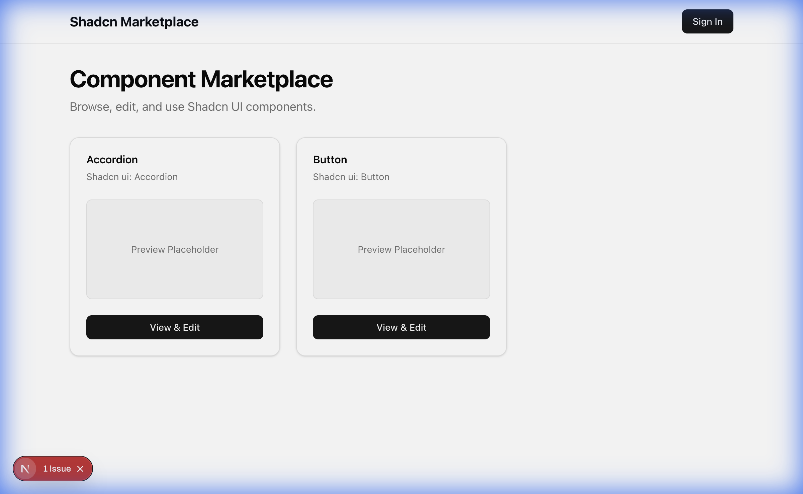

# Shadcn Marketplace

[](https://opensource.org/licenses/MIT)

A beautiful marketplace for discovering and previewing Shadcn UI components with live code editing.



## Overview

**Shadcn Marketplace** helps developers and designers quickly preview and evaluate Shadcn UI components before copying the code to their codebase. Instead of browsing through documentation or demos, you can:

- 🎨 **Preview components instantly** with live rendering
- ✏️ **Edit code in real-time** using an integrated code editor
- 🎭 **Test different themes** to see how components adapt
- 📦 **Browse by category** to find exactly what you need
- 🚀 **Copy and use** components in your projects immediately

Built with modern web technologies for a smooth, fast experience.

## Tech Stack

- **[Next.js](https://nextjs.org)** - React framework for production
- **[Shadcn UI](https://ui.shadcn.com)** - Beautiful, accessible component system
- **[Convex](https://convex.dev)** - Backend and database
- **[Sandpack](https://sandpack.codesandbox.io)** - Live code editing and preview
- **[Clerk](https://clerk.com)** - Authentication and user management

## Quick Start

### Prerequisites

- Node.js 18+ and pnpm
- Convex account ([sign up free](https://convex.dev))
- Clerk account ([sign up free](https://clerk.com))

### Installation

1. **Clone the repository**
   ```bash
   git clone https://github.com/your-username/shadcn-marketplace.git
   cd shadcn-marketplace
   ```

2. **Install dependencies**
   ```bash
   pnpm install
   ```

3. **Set up environment variables**
   
   Create a `.env.local` file:
   ```bash
   NEXT_PUBLIC_CONVEX_URL=your_convex_deployment_url
   NEXT_PUBLIC_CLERK_PUBLISHABLE_KEY=your_clerk_publishable_key
   CLERK_SECRET_KEY=your_clerk_secret_key
   ```

4. **Run the development server**
   ```bash
   pnpm dev
   ```

5. **Open your browser**
   
   Navigate to [http://localhost:3000](http://localhost:3000)

## Deployment

### Deploying to Cloudflare Pages

This application is ready to deploy on Cloudflare Pages with standard Next.js configuration.

#### Prerequisites

- Cloudflare account ([sign up free](https://dash.cloudflare.com/sign-up))
- Git repository (GitHub, GitLab, or Bitbucket)

#### Simple Deployment Steps

1. **Connect your repository**
   - Go to [Cloudflare Pages Dashboard](https://dash.cloudflare.com/pages)
   - Click "Create a project" → "Connect to Git"
   - Select your repository

2. **Configure build settings** (Cloudflare will auto-detect Next.js)
   - **Framework preset:** Next.js (auto-detected)
   - **Build command:** `pnpm build` (default)
   - **Build output directory:** `.next` (default - auto-detected)
   - **Root directory:** (leave empty unless your app is in a subdirectory)
   - **Node version:** 18 or higher

3. **Set environment variables**
   
   In the Cloudflare Pages dashboard → Settings → Environment variables, add:
   ```
   NEXT_PUBLIC_CONVEX_URL=your_convex_deployment_url
   NEXT_PUBLIC_CLERK_PUBLISHABLE_KEY=your_clerk_publishable_key
   CLERK_SECRET_KEY=your_clerk_secret_key
   CLERK_JWT_ISSUER_DOMAIN=your_clerk_jwt_issuer_domain
   ```
   
   **Important:** Add these for both "Production" and "Preview" environments.

4. **Deploy**
   - Click "Save and Deploy"
   - Cloudflare will automatically build and deploy your Next.js app
   - Your site will be available at `your-project.pages.dev`

#### Important Notes

- **Auto-detection:** Cloudflare Pages automatically detects Next.js and configures the build
- **Image Optimization**: Configured with `unoptimized: true` for Cloudflare compatibility
- **Middleware**: Clerk middleware works seamlessly with Cloudflare Edge runtime
- **External Services**: Convex and Clerk are external services that work perfectly with Cloudflare Pages

### Environment Variables Reference

| Variable | Description | Required |
|----------|-------------|----------|
| `NEXT_PUBLIC_CONVEX_URL` | Your Convex deployment URL | Yes |
| `NEXT_PUBLIC_CLERK_PUBLISHABLE_KEY` | Clerk publishable API key | Yes |
| `CLERK_SECRET_KEY` | Clerk secret API key (server-side) | Yes |
| `CLERK_JWT_ISSUER_DOMAIN` | Clerk JWT issuer domain for Convex auth | Yes |

## Contributing

We welcome contributions! Whether you want to fix bugs, add features, or submit new components to the marketplace, please read our [Contributing Guide](CONTRIBUTING.md) to get started.

Component submissions go through a manual QC process to ensure quality and consistency.

## License

This project is licensed under the MIT License - see the [LICENSE](LICENSE) file for details.

## Acknowledgments

Built with ❤️ using [Shadcn UI](https://ui.shadcn.com) components and inspired by the amazing work of [@shadcn](https://twitter.com/shadcn).
